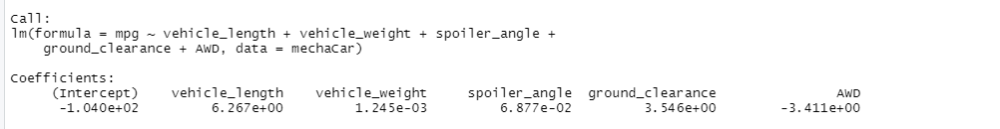
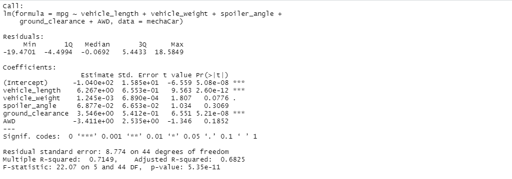
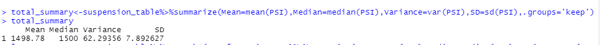
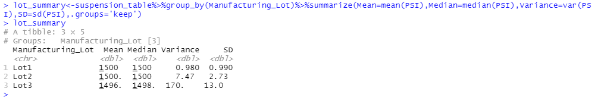
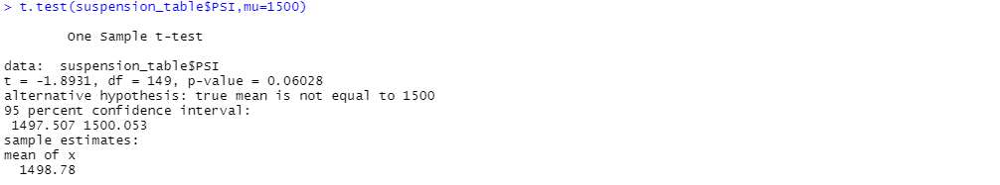
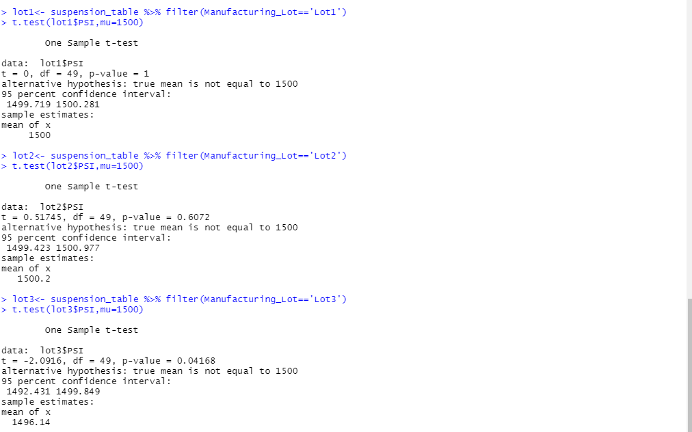

# MechaCar_Statistical_Analysis

## Project Overview
Nowadays AutosRUs' newest prototype, the MechaCar is suffering from a production troubles which are stopping the progress of manufacturing team, Hence Jeremy and his data analytics team is assigned on analysis of production data to give valuable insights to upper management to implement some new work standards to help manufacturing team. Team will be focusing on doing following tasks:
1. Perform linear regression analysis to identify variable predicting mpg of MechaCar prototypes.
2. Collect summary statistics on PSI of suspension coils from manufacturing lots.
3. Perform T-Test for verifying the difference of manufacturing lots and mean population.
4. Statistical study to compare vehicle performance of MechaCar vehicles against other company vehicles. 

### Linear Regression to Predict MPG
Our multiple linear regression statement is:
lm(mpg ~ vehicle_length + vehicle_weight + spoiler_angle + ground_clearance + AWD,data = mechaCar)

1. Which variables/coefficients provided a non-random amount of variance to the mpg values in the dataset?
In the above dataset, ground clearance p-value i.e. 5.21e-08 and vehicle length p value of 2.60e-12 are the variables/coefficients providing a non random amount of variance to the mpg values. 

2. Is the slope of the linear model considered to be zero? Why or why not?
P value of this analysis is 5.35e-11 < than the assumed significance of 0.05% hence slope of this model is not zero as we can't reject the null hypothesis. 

3. Does this linear model predict mpg of MechaCar prototypes effectively? Why or why not?
Coefficient of vehicle length and ground clearance variable helps in predicting mpg value and there is a corelation between dependant and independant values which proves that it does predict mpg of MechaCar prototypes effectively but still there is a room for imrpovement. 

### Summary Statistics on Suspension Coils
Following table shows the mean, median, variance and standard deviation of weight capacities of various manufacturing lots to test suspension coils:

- The design specifications for the MechaCar suspension coils dictate that the variance of the suspension coils must not exceed 100 pounds per square inch. Does the current manufacturing data meet this design specification for all manufacturing lots in total and each lot individually? Why or why not?
For lot 1 and lot 2 are under the design specification standards but lot 3 shows around 170.29 which exceeds the design specification of MechaCar suspension of 100 pounds per square inch. Variance of PSI i.e. current manufacturing data shows 62.29 variance which does meet standards for sure. 

### T-Tests on Suspension Coils

P value of all manufacturing units is greater than level of significance of 0.05 because of which we reject null hypothesis. This fails to provide proof of showing mean of all manufacturing lots is statistically different from population mean of 1500 per square inch. For lot 1 and lot 2, p value is greater than level of significance while lot 3 p value is less than it hence by rejecting null hypothesis, we prove that mean of lot 3 is significantly different from population mean of 1500 per square inch. 

## Study Design: MechaCar vs Competition
This study on MechaCar vs its competitors considers metrics such as safety rating, color, cost, fuel efficiency, drive performance, horsepower and performance rating. 
Here are the description on following points:
- What metric or metrics are you going to test?
Top metric we are going to test in this study are safety rating of Mecha Car and its competitors depending on fuel efficiency. 

- What is the null hypothesis or alternative hypothesis?
In general, null hypothesis is no statistical difference in between mean for safety rating of various cars when significance level set at 0.05. While alternative hypothesis is opposite to it, where there is a statistical difference. In this case, fuel efficiency has statistical difference when various cars are compared and ignificance level is also set at 0.05 hence it is identified as null hypothesis. 

- What statistical test would you use to test the hypothesis? And why?
To this hypothesis, we will consider multiple regression model which will take safety rating and fuel efficiency metric in testing. This will help to compare both metrics, find out which has higher impact and improve study results. 

- What data is needed to run the statistical test?
We need Fuel efficiency and safety rating data for Mecha Car and it's competitors to run multiple regression test. 
